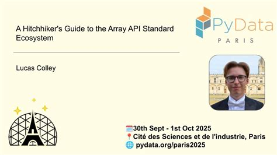
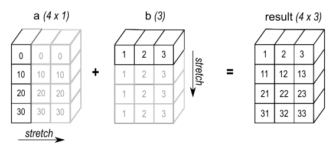
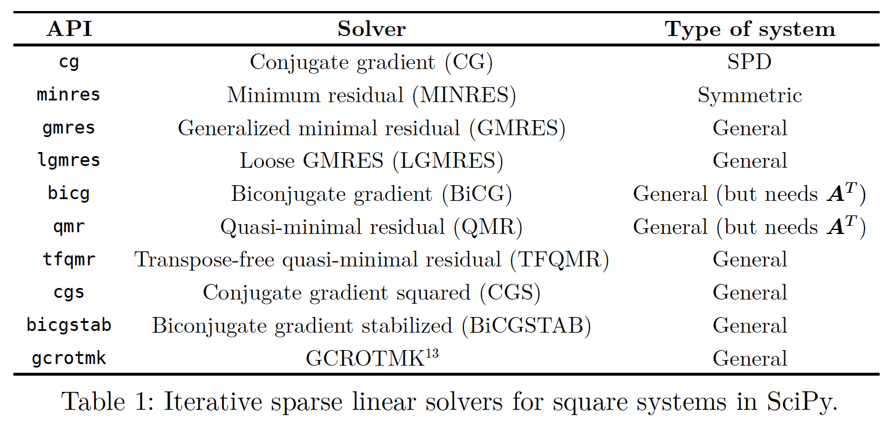
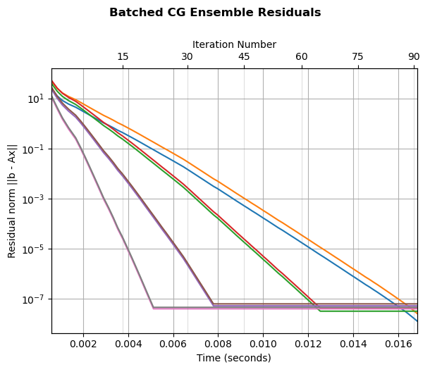
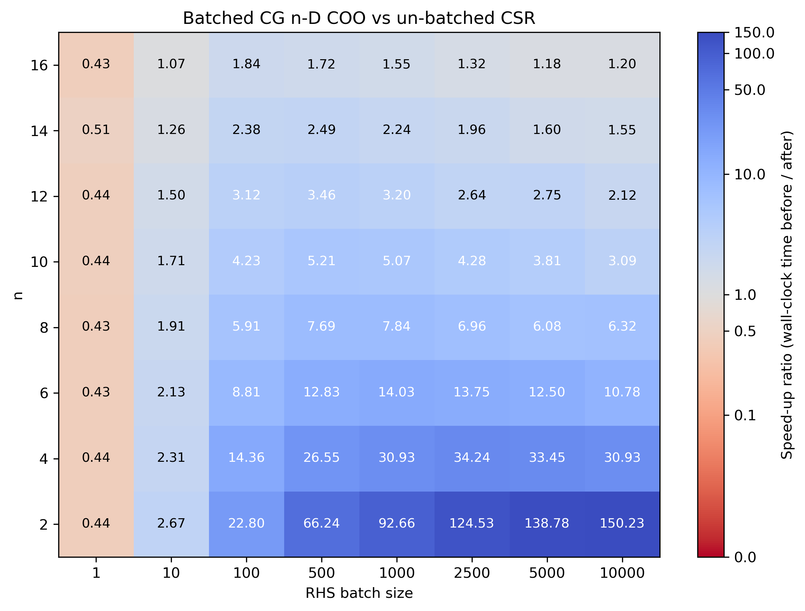
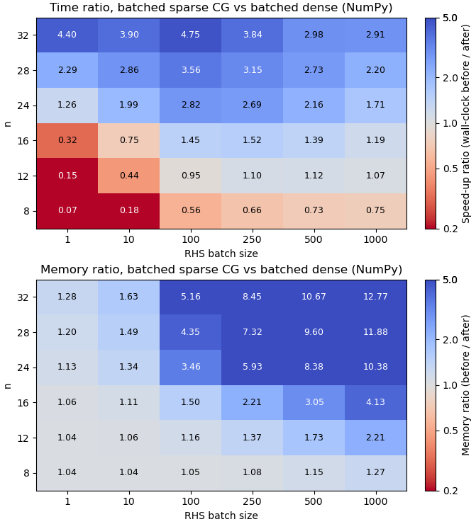



## About Me

::: {layout="[70,30]"}

::: {#first-column}

- Maintainer: [SciPy](https://scipy.org), [Pixi](https://pixi.sh/latest/)
- Member of the [Consortium for Python Data API Standards](https://data-apis.org)
- Just finished at the University of Oxford, studying the MCompPhil (Computer Science & Philosophy)

:::

{fig-align="right"}

:::

## Agenda

1. Context and Motivation
2. What is a `LinearOperator`?
3. Enhancement Process
4. What did we learn?

# Context and Motivation

## Background

- Project for my master's dissertation at university
- Aim: balance my technical experience in SciPy with academic research into a new area
- Another big aim: produce code that can be merged into SciPy and be useful for other people beyond the scope of my research!

## Research Area (1/3)

- Rough idea: look at adding array API standard support and batching support to (some of) [`scipy.sparse.linalg`](https://docs.scipy.org/doc/scipy/reference/sparse.linalg.html)
    - A module of linear algebra algorithms for sparse data

## Research Area (2/3)

- The Python Array API Standard — interoperability
    - Support for other array types to NumPy
    - Towards GPU support + `jax.jit` / `torch.compile`
- Check out [my PyData Paris 2025 talk on this](https://youtu.be/LBVzkCSmjsQ?si=T5Xbtd3GIrshRhKg)

{width=42% fig-align="center"}

## Research Area (3/3)

- Batching — [Tutorial in SciPy](https://docs.scipy.org/doc/scipy/tutorial/linalg_batch.html)
- Efficiently solve many of the same problem at once
    - Common example: NumPy broadcasting operations

::: {.img-bg}
{fig-align="center"}
:::

## Iterative Linear Solvers (1/2)

- Focused my scope in on the iterative solvers
- Solving a linear system $A x = b$ for $x$
    - In the batched context, you can have many $A$ and many $b$
- The system may be _sparse_:
    - $A$ has few nonzero entries => represent in a specialised sparse data structure
- $A$ may not be represented by its concrete elements, but rather in terms of its matrix-vector product function

## Iterative Linear Solvers (2/2)

- _Iterative_ solvers:
    - Start with a _guess_ for $x$
    - Each iteration, they do some computation to better approximate $x$

{width=50% fig-align="center"}

## Enter `LinearOperator`

- Before the _solver algorithms_ gain this support, we need the underlying _data structure_ to gain support
    - Naïvely, I thought that this would be just a quick first step!
- `scipy.sparse.linalg.LinearOperator` is the data structure used by these algorithms

# What is a `LinearOperator`?

## The Linear Operator data structure

- An abstraction over matrix-like objects in $\mathbb{C}^{m \times n}$
- Has associated multiplication functions:
    - matrix-vector
    - matrix-matrix
- Transposition, composition, summation, scalar multiplication, and exponentiation to integral powers
all yield a new Linear Operator

## `LinearOperator`

- [`scipy.sparse.linalg.LinearOperator`](https://docs.scipy.org/doc/scipy/reference/generated/scipy.sparse.linalg.LinearOperator.html)
    - Originally contributed 18 years ago!
- [`scipy.sparse.linalg.aslinearoperator`](https://docs.scipy.org/doc/scipy/reference/generated/scipy.sparse.linalg.aslinearoperator.html)
can convert dense or sparse arrays to a `LinearOperator`
- Can also be constructed from a user-supplied `matvec` callable, or via subclassing
- Has `matvec` and `matmat` multiplication methods
    - Various other methods and attributes

## Requirements

- Enable:
    - representing batches of operators in $\mathbb{C}^{B \times m \times n}$
    - using alternative array types for I/O and computation
- Requires:
    - removing assumptions of 2-D data
    - generalising NumPy operations to use the array API
- Without breaking the world!

# Enhancement Process

## Getting Started

- Opened a draft PR on October 22nd 2025
    - Prototype already working for some examples!
- But this was just the beginning...

## Input/Output

- Stop hardcoding `ndim = 2`
- Refer to the _last_ two dimensions instead of the _first_ two:

```diff
class _AdjointLinearOperator(LinearOperator):
    def __init__(self, A):
-        shape = (A.shape[1], A.shape[0])
+        shape = (*A.shape[:-2], A.shape[-1], A.shape[-2])
```

## `xp` arrays

```diff
class LinearOperator:
...
-    def __init__(self, dtype, shape):
+    def __init__(self, dtype, shape, xp=None):
+        xp = np if xp is None else xp
+        self._xp = xp
```

- some simple swaps:
```diff
if self.dtype is None:
-    v = np.zeros(self.shape[-1], dtype=np.int8)
+    v = self._xp.zeros(self.shape[-1], dtype=xp.int8)
```

```diff
def _matmat(self, X):
-    return self.A.dot(X)
+    return self.A @ X
```

## Batched Computation (1/2)

- We follow standard NumPy broadcasting rules when combining batches of input

::: {.img-bg}
{fig-align="center"}
:::

## Batched Computation (2/2)

- Use `...` indexing to allow arbitrary batch dimensions to pass through:
```diff
# a default implementation of matrix-matrix multiplication
# in terms of matrix-vector multiplication
def _matmat(X):
- return np.hstack([self.matvec(col.reshape(-1,1)) for col in X.T])
+ return np.stack(
+   [self._matvec(X[..., :, i]) for i in range(X.shape[-1])], axis=-1
+ )
```

## Challenges: backwards-compatibility

- However: code written against the old implementation must not be broken when upgrading to the new implementation
- This forces us to still iterate through columns
here, in case matvec does not support batched computation:
```diff
# a default implementation of matrix-matrix multiplication
# in terms of matrix-vector multiplication
def _matmat(X):
- return np.hstack([self.matvec(col.reshape(-1,1)) for col in X.T])
+ return np.stack(
+   [self._matvec(X[..., :, i]) for i in range(X.shape[-1])], axis=-1
+ )
```

## Challenges: pickle-ability (1/2)

- While not explicitly documented, another backwards-compatibility constraint
is that [`pickle`](https://docs.python.org/3/library/pickle.html) should continue to work
on `LinearOperator` objects.
- Our test-suite caught this!

## Challenges: pickle-ability (2/2)

- Modules (like `np` or `self._xp`) cannot be pickled, so we instead tell pickle how to
represent the state with an array (`self._xp.empty(0)`), and recover `self._xp`:

```python
def __getstate__(self):
    state = self.__dict__.copy()
    state["_xp"] = state["_xp"].empty(0)
    return state

def __setstate__(self, state):
    self._xp = array_namespace(state.pop("_xp"))
    self.__dict__.update(state)
```

## Challenges: poor documentation

- The documentation was not great — both user-facing and developer-facing!
- A lot of my time was spent trying to get in the heads of whoever wrote the code,
to understand what their intentions were
    - More docstrings and comments would have been very helpful!

## Challenges: bad decisions?

- `matvec` promised to accept $1$-dimensional vectors not only in row-vector format (shape `(n,)`),
but _also_ in column-vector format (shape `(n, 1)`)
    - Seemingly for convenience
- But keeping this with batch dimensions would introduce complexity and ambiguity...

## Challenges: deprecation

- ... so it was decided to deprecate support for the column-vector format,
moving towards a clearer API where `matvec` operates on (batches of) row vectors
- SciPy policy: emit a `DeprecationWarning` for 2 minor releases (~1 year) before removal

## We got there eventually!


- [PR merged](https://github.com/scipy/scipy/pull/23836) with only 248 comments :)
- 4 months of iterating
    - improving tests and docs
    - fixing bugs

# What did we learn?

## Established code can be 'bad'

- Sometimes a small prototype can end up becoming the de facto standard as a historical accident!
- Incremental improvements are not always well thought out
    - Inconsistencies can arise, when changes are made to one part of the interface but not another

## Refactoring can be useful

- Careful refactoring can help a lot!
- Reducing code duplication and factoring out common functionality can help catch bugs and ensure behaviour is consistent

## Backwards-compatibility is very important

- Probably, there are a lot more people hoping that existing functionality will keep working
than are waiting for whatever you are adding!
- But: exactly _what_ respecting backwards-compatibility means can be a judgement call
    - It required surprisingly careful attention to determine what the implicit contract was between the API and its users

## Testing is crucial (1/2)

- Some bugs evaded me for a while
    - e.g. incorrect broadcasting behaviour for edge cases like empty arrays
- For big changes, don't just get the existing tests passing — figure out what tests are _missing_

## Testing is crucial (2/2)

- Pre-existing tests were focused around a few particular cases with hardcoded numbers
- [PR adding a whole new style of tests](https://github.com/scipy/scipy/pull/23969)
    - More systematic
    - Using random data
    - Making heavy use of `pytest.mark.parametrize` over dtypes, shapes etc.

## Write good documentation

- For users, for yourself, and for future developers
- Force yourself to _explain_ what the interface is promising users,
and how that is achieved

## With thanks to:

- all reviewers involved in the PRs discussed in this talk!
    - especially [Matt Haberland](https://mdhaber.wixsite.com/home)
- Patrick J. Roddy for this Quarto talk template
- the EuroSciPy 2026 organisers and volunteers
- everyone for your attention!

## Bonus: using the enhancements! (1)

{fig-align="center" width=60%}

## Bonus: using the enhancements! (2)

{fig-align="center" width=65%}

## Bonus: using the enhancements! (3)

{fig-align="center" width=45%}
